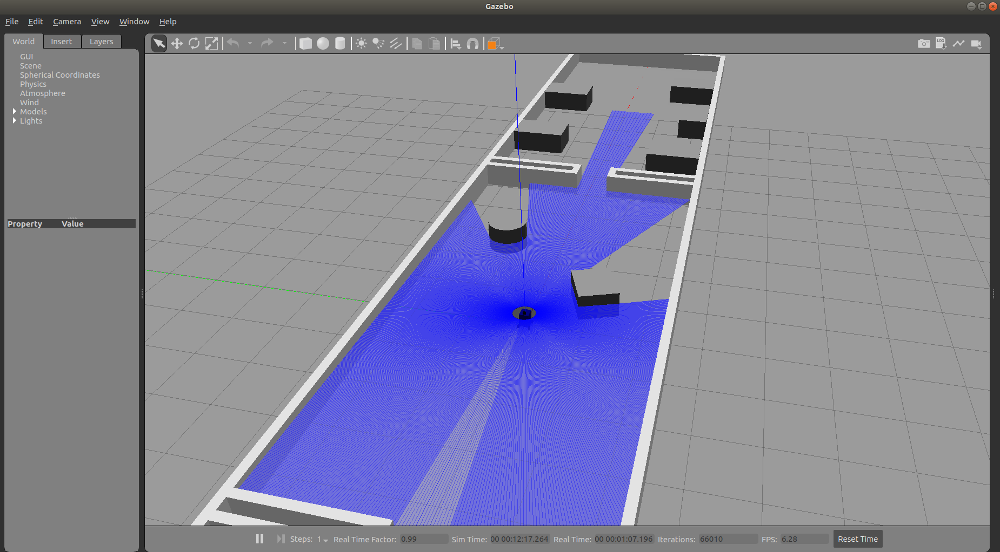
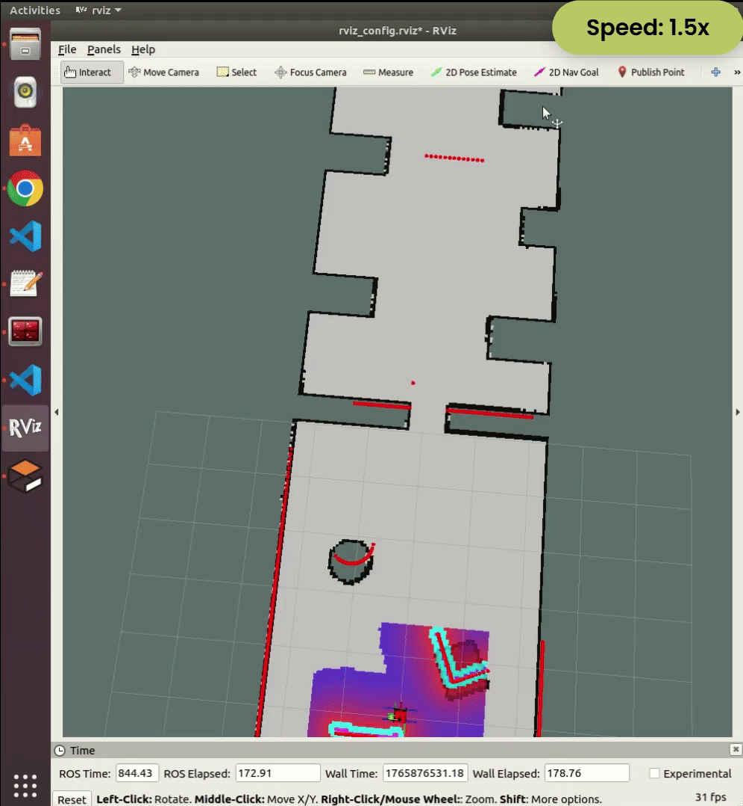
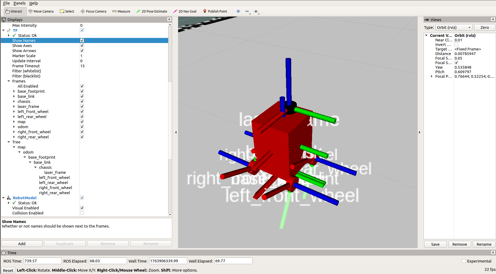

# Autonomous Mobile Robot Project (ROS Melodic)


## 📖 Project Overview

This project focuses on designing, simulating, and navigating a **differential drive mobile robot** within the **Robot Operating System (ROS)** framework. The primary goal is to demonstrate a complete autonomous navigation pipeline, ranging from chassis modeling to path planning in a dynamic environment.

The system is simulated in **Gazebo**, utilizing sensor fusion (Lidar & IMU) to perform Simultaneous Localization and Mapping (**SLAM**) and autonomous navigation using the ROS Navigation Stack.

---
## 📊 Simulation Results
### 1. Mapping Process (SLAM - Gmapping)
*The robot explores the unknown environment and builds a 2D occupancy grid map.*

**The Simulation Environment (Gazebo):**


**Real-time Mapping (RViz):**

*The robot creates the map while teleoperating through the environment.*

### 2. Autonomous Navigation and Obstacle Avoidance (AMCL + Move Base + DWA)

*The robot localizes itself and plans a path to the user-defined goal while avoiding obstacles.*

<p align="center">
  
  <br>
  <em>Red line represents global path and the green one represents local path.</em>
</p>


<p align="center">
  <em>Demonstration of the local planner avoiding dynamic obstacles.</em>
</p>

---

## 🚀 Key Technical Features

### 1. Robot Modeling (URDF & Xacro)
* **Chassis Design:** Developed a custom differential drive robot using **URDF** (Unified Robot Description Format) and **Xacro** for modular code structure.
* **Physics Simulation:** Configured inertia matrices, collision boundaries, and friction coefficients to ensure realistic kinematic behavior in the Gazebo physics engine.

**Robot Model in RViz:**
<p align="center">
  
  <br>
  <em>Visualization of the robot chassis, wheels, and sensors.</em>
</p>

*The Transform (TF) tree defines the relationship between coordinate frames (odom -> base_footprint -> base_link -> sensors), ensuring accurate localization and sensor data processing.*

* **Sensor Integration:**
    * **Lidar (S2E):** Integrated for 2D obstacle detection and mapping.
    * **IMU (Inertial Measurement Unit):** Integrated to provide accurate orientation (yaw/pitch/roll) and acceleration data to improve pose estimation.

### 2. SLAM (Simultaneous Localization and Mapping)
* Implemented the **gmapping** package (based on the FastSLAM algorithm) to generate a high-resolution 2D occupancy grid map of unknown environments.
* Optimized laser scan matching parameters to reduce map drifting and enhance loop closure accuracy.

### 3. Autonomous Navigation System
* **Localization (AMCL):** Utilized the Adaptive Monte Carlo Localization (particle filter) to track the robot's pose within a known map with high accuracy.
* **Path Planning (Move Base):**
    * **Global Planner:** Implemented Dijkstra/A* algorithms for calculating the optimal path from start to goal.
    * **Local Planner:** Tuned the Dynamic Window Approach (DWA) controller to execute smooth velocity commands and avoid dynamic obstacles in real-time.
    * **Costmaps:** Configured global and local costmap layers (inflation, obstacle) to define safe navigation zones.

### 4. Simulation Environment
* Designed a custom Gazebo world featuring complex geometries, narrow corridors, and obstacles to rigorously test the robot's navigation capabilities.

---

## 🛠 Technology Stack

| Component | Technology / Library |
| :--- | :--- |
| **OS** | Ubuntu 18.04 (Bionic) |
| **Middleware** | ROS Melodic |
| **Simulation** | Gazebo, RViz |
| **Languages** | C++, Python, XML (Launch/URDF) |
| **Build System** | Catkin |
| **Key Packages** | `gmapping`, `amcl`, `move_base`, `xacro`, `gazebo_ros` |

---

## 📂 Project Structure

```bash
my_robot/
├── launch/             # Launch files (world, amcl, mapping)
├── urdf/               # Robot description files (.xacro)
├── world/              # Custom simulation environments (.world)
├── maps/               # Generated maps (.pgm and .yaml)
├── config/             # Navigation parameter files (costmaps, planners)
├── assets/
├── package.xml
└── CMakeLists.txt      # Build configuration
```

## 💻 How to run
### 1. Build the package

```bash
cd ~/catkin_ws
catkin_make
source devel/setup.bash
```

### 2. Launch simulation

```bash
roslaunch my_robot sim_robot.launch
```

## 3. Run navigation

```bash
roslaunch my_robot navigation.launch
```

## 👤 Author <br>
Name: Hoang An Nguyen <br>
GitHub: NguyenAn080105 <br>
Email: nguyenan080105@gmail.com